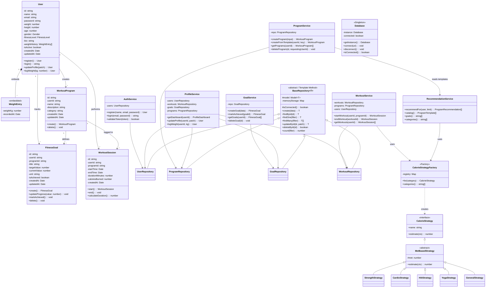

# Class Diagram — Fitness Tracker System

## Overview

This class diagram represents the domain models, service layer, repository layer, and supporting patterns of the Fitness Tracker System.
The design follows Clean Architecture principles (Controller → Service → Repository → Model) and applies core Object-Oriented Programming (OOP) principles together with four deliberate design patterns: **Singleton**, **Template Method**, **Strategy**, and **Factory**.

---

## Design Patterns in the Class Diagram

| Pattern              | Where Applied                                                 | Purpose                                                                       |
| -------------------- | ------------------------------------------------------------- | ----------------------------------------------------------------------------- |
| **Singleton**        | `Database`                                                    | Guarantees a single, process-wide MongoDB connection lifecycle.               |
| **Template Method**  | `BaseRepository<T>` (generic CRUD + Mongo/in-memory fallback) | Reuses a single CRUD skeleton across every concrete repository subclass.      |
| **Strategy**         | `CalorieStrategy` + `MetBasedStrategy` family                 | Varies the calorie-burn algorithm per workout category without conditionals. |
| **Factory**          | `CalorieStrategyFactory`                                      | Selects the correct `CalorieStrategy` for a program's category.              |
| **Repository**       | `UserRepository`, `ProgramRepository`, `GoalRepository`, `WorkoutRepository` | Abstracts persistence from services.                                          |
| **Service Layer**    | `AuthService`, `ProfileService`, `RecommendationService`, …   | Centralises business logic separate from HTTP concerns.                       |
| **Layered Architecture** | Controller → Service → Repository → Model                | Enforces separation of concerns across the whole stack.                       |

## OOP Principles Applied

| Principle                           | Application                                                                  |
| ----------------------------------- | ---------------------------------------------------------------------------- |
| **Encapsulation**                   | Models hide schema internals; services expose intent-named methods.          |
| **Abstraction**                     | `BaseRepository` and `CalorieStrategy` hide concrete implementations.        |
| **Inheritance**                     | Concrete repositories extend `BaseRepository`; concrete strategies extend `MetBasedStrategy`. |
| **Polymorphism**                    | `CalorieStrategyFactory.for(...)` returns any strategy through a common interface. |
| **Single Responsibility Principle** | One class, one reason to change — e.g. `RecommendationService` only ranks.   |
| **Open/Closed Principle**           | Add a new workout category by writing a new `Strategy` + registering it.     |
| **Separation of Concerns**          | Controllers parse HTTP, services decide, repositories persist.               |
