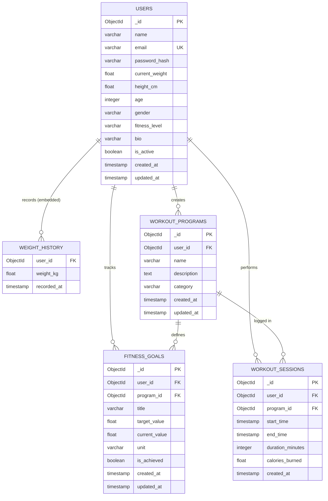

# ER Diagram — Fitness Tracker System

## Overview

This Entity-Relationship diagram represents the database schema for the Fitness Tracker System, a backend-focused application that helps users manage their workout programs, fitness goals, and session logs while also exposing a personal dashboard (BMI, streaks) and personalised program recommendations.

The schema models user authentication, rich profile metadata (age / gender / fitness level / weight history), program creation, goal tracking, and workout session logging — while enforcing data isolation per user.

---

---

## Table / Collection Summary

| Collection          | Description                                                             | Key Relationships                |
| ------------------- | ----------------------------------------------------------------------- | -------------------------------- |
| `USERS`             | Registered users + personal stats (weight, height, age, gender, fitness level, bio). | → Programs, Goals, Sessions     |
| `WEIGHT_HISTORY`    | Embedded subdocument inside `USERS` — chronological weight log used for trend analytics. | ← User (embedded)              |
| `WORKOUT_PROGRAMS`  | Programs created by users (optionally materialised from a template).    | ← User, → Goals, → Sessions     |
| `FITNESS_GOALS`     | Specific fitness targets (e.g., "Squat 100kg").                         | ← User, ← Program               |
| `WORKOUT_SESSIONS`  | Logs of actual time spent working out with calorie burn (MET formula).  | ← User, ← Program               |

> **Note**: In the MongoDB implementation, `AUTH_TOKENS` is **not** a persistent collection. The system uses stateless JWTs signed at login and verified on each request by `authMiddleware`, so tokens do not need to be stored.

---

## Derived / Computed Fields

These are never written to disk — they are assembled on the fly by `ProfileService.getDashboard()`:

| Field                  | Source                                                          |
| ---------------------- | --------------------------------------------------------------- |
| `body.bmi`             | `USERS.current_weight / (height_cm / 100)^2`                    |
| `body.bmiCategory`     | Classification of `bmi` (underweight / healthy / overweight / obese). |
| `stats.currentStreakDays` | Walk back from today through unique completed-session day keys. |
| `stats.longestStreakDays` | Longest consecutive-day run across the same day-key set.      |
| `stats.workoutsThisWeek` / `workoutsThisMonth` | Rolling 7- / 30-day filters on `end_time`. |
| `goals.achievementRate`   | `achieved / total * 100` rounded to 0.1.                     |

---

## Key Indexes

| Collection         | Index                   | Purpose                                     |
| ------------------ | ----------------------- | ------------------------------------------- |
| `USERS`            | `(email)` UNIQUE        | Fast login and authentication lookup        |
| `WORKOUT_PROGRAMS` | `(user_id)`             | Fetch programs belonging to a specific user |
| `FITNESS_GOALS`    | `(user_id, program_id)` | Efficient goal retrieval per program        |
| `FITNESS_GOALS`    | `(is_achieved)`         | Filter pending vs achieved goals            |
| `WORKOUT_SESSIONS` | `(user_id)`             | Fetch user workout history                  |
| `WORKOUT_SESSIONS` | `(program_id)`          | Fetch sessions for a specific program       |
| `WORKOUT_SESSIONS` | `(user_id, end_time)`   | Streak / windowed analytics on completed sessions. |
