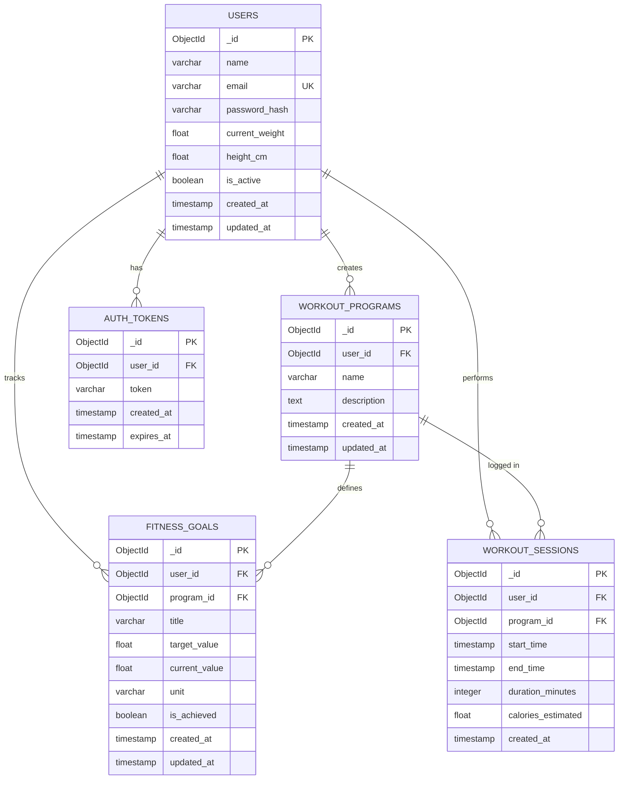

# ER Diagram — Fitness Tracker System

## Overview

This Entity-Relationship diagram represents the database schema for the Fitness Tracker System, a backend-focused application designed to help users manage their workout programs, fitness goals, and session logs securely.

The schema models user authentication, program creation, goal tracking, and workout session logging, while enforcing data isolation and structured backend architecture.

---

---

## Table Summary

| Table              | Description                                                  | Key Relationships           |
| ------------------ | ------------------------------------------------------------ | --------------------------- |
| `USERS`            | Stores all registered users and personal stats (weight, etc) | → Programs, Goals, Sessions |
| `WORKOUT_PROGRAMS` | Stores programs created by users (e.g., "Leg Day")           | ← User, → Goals, → Sessions |
| `FITNESS_GOALS`    | Stores specific fitness targets (e.g., "Squat 100kg")        | ← User, ← Program           |
| `WORKOUT_SESSIONS` | Stores logs of actual time spent working out                 | ← User, ← Program           |
| `AUTH_TOKENS`      | Stores JWT tokens for authentication                         | ← User                      |

---

## Key Indexes

| Table              | Index                   | Purpose                                     |
| ------------------ | ----------------------- | ------------------------------------------- |
| `USERS`            | `(email)`               | Fast login and authentication lookup        |
| `WORKOUT_PROGRAMS` | `(user_id)`             | Fetch programs belonging to a specific user |
| `FITNESS_GOALS`    | `(user_id, program_id)` | Efficient goal retrieval per program        |
| `FITNESS_GOALS`    | `(is_achieved)`         | Filter pending vs achieved goals            |
| `WORKOUT_SESSIONS` | `(user_id)`             | Fetch user workout history                  |
| `WORKOUT_SESSIONS` | `(program_id)`          | Fetch sessions for a specific program       |
