# Sequence Diagram — Fitness Tracker System

## Main Flow: Authentication → Program Management → Goal Tracking → Workout Logging → Profile Dashboard → Recommendations

This sequence diagram captures the complete lifecycle of a user interacting with the Fitness Tracker System — from registering and logging in, to building programs, tracking sessions, reviewing their personal dashboard, and receiving personalised program recommendations.

```mermaid

sequenceDiagram
    actor U as User
    participant FE as Frontend (React Client)
    participant API as Backend API (Express)
    participant Auth as AuthService
    participant ProgS as ProgramService
    participant GoalS as GoalService
    participant WorkS as WorkoutService
    participant ProfS as ProfileService
    participant RecS as RecommendationService
    participant Cal as CalorieStrategyFactory
    participant Repo as Repository (BaseRepository)
    participant DB as MongoDB (or in-memory fallback)

    Note over U, DB: Phase 1 — Registration and Authentication

    U ->> FE: Register Account
    FE ->> API: POST /api/auth/register
    API ->> Auth: register(userData)
    Auth ->> Repo: UserRepository.create(userData)
    Repo ->> DB: INSERT user document
    DB -->> Repo: User created
    Repo -->> Auth: User saved
    Auth -->> API: 201 Created (user + token)
    API -->> FE: 201 Created
    FE -->> U: Account registered successfully

    U ->> FE: Login
    FE ->> API: POST /api/auth/login
    API ->> Auth: login(email, password)
    Auth ->> Repo: UserRepository.findOne({ email })
    Repo ->> DB: SELECT user document
    DB -->> Repo: User found
    Repo -->> Auth: User + password hash
    Auth ->> Auth: Compare bcrypt + sign JWT
    Auth -->> API: JWT token
    API -->> FE: 200 OK + token
    FE -->> U: Login successful

    Note over U, DB: Phase 2 — Workout Program Management

    U ->> FE: Create Workout Program
    FE ->> API: POST /api/programs (JWT)
    API ->> Auth: authMiddleware(JWT)
    Auth -->> API: userId
    API ->> ProgS: createProgram({ userId, name, category })
    ProgS ->> Repo: ProgramRepository.create(...)
    Repo ->> DB: INSERT program document
    DB -->> Repo: Program created
    Repo -->> ProgS: Program saved
    ProgS -->> API: 201 Created
    API -->> FE: 201 Created
    FE -->> U: Program created successfully

    U ->> FE: Adopt Template (e.g. "HIIT Fat Burner")
    FE ->> API: POST /api/programs/from-template
    API ->> ProgS: createFromTemplate(userId, key)
    ProgS ->> ProgS: Look up PROGRAM_TEMPLATES[key]
    ProgS ->> Repo: ProgramRepository.create(materialised)
    Repo ->> DB: INSERT program
    DB -->> Repo: OK
    Repo -->> ProgS: Program
    ProgS -->> API: 201 Created
    API -->> FE: Template adopted
    FE -->> U: Program added to your list

    Note over U, DB: Phase 3 — Goal Setting

    U ->> FE: Create Fitness Goal
    FE ->> API: POST /api/goals (JWT)
    API ->> GoalS: createGoal(goalData)
    GoalS ->> Repo: GoalRepository.create(...)
    Repo ->> DB: INSERT goal
    DB -->> Repo: Goal created
    Repo -->> GoalS: OK
    GoalS -->> API: 201 Created
    API -->> FE: 201 Created
    FE -->> U: Goal set successfully

    U ->> FE: Mark Goal as Achieved
    FE ->> API: PUT /api/goals/{id}/achieve (JWT)
    API ->> GoalS: markAchieved(goalId)
    GoalS ->> Repo: GoalRepository.updateById(...)
    Repo ->> DB: UPDATE goal
    DB -->> Repo: OK
    Repo -->> GoalS: Updated goal
    GoalS -->> API: 200 OK
    API -->> FE: Goal updated
    FE -->> U: Goal marked as achieved!

    Note over U, DB: Phase 4 — Workout Session Logging + Calorie Strategy

    U ->> FE: Start Workout
    FE ->> API: POST /api/workouts/start (JWT)
    API ->> WorkS: startWorkout(userId, programId)
    WorkS ->> Repo: WorkoutRepository.create({ startTime })
    Repo ->> DB: INSERT session
    DB -->> Repo: OK
    Repo -->> WorkS: Session
    WorkS -->> API: 201 Created
    API -->> FE: Timer started

    U ->> FE: End Workout
    FE ->> API: PUT /api/workouts/{id}/end (JWT)
    API ->> WorkS: endWorkout(sessionId)
    WorkS ->> Repo: WorkoutRepository.findById(id)
    Repo ->> DB: SELECT session + program
    DB -->> Repo: Session, Program
    Repo -->> WorkS: Session + Program
    WorkS ->> Cal: for(program.category)
    Cal -->> WorkS: CalorieStrategy (Strength / Cardio / HIIT / Yoga / General)
    WorkS ->> WorkS: strategy.estimate({ duration, weightKg })
    WorkS ->> Repo: WorkoutRepository.updateById(endTime, duration, calories)
    Repo ->> DB: UPDATE session
    DB -->> Repo: OK
    Repo -->> WorkS: Updated session
    WorkS -->> API: 200 OK
    API -->> FE: Session concluded
    FE -->> U: Workout logged successfully

    Note over U, DB: Phase 5 — Profile Dashboard

    U ->> FE: Open Profile
    FE ->> API: GET /api/profile (JWT)
    API ->> ProfS: getDashboard(userId)
    ProfS ->> Repo: UserRepository.findById(userId)
    Repo ->> DB: SELECT user
    DB -->> Repo: User
    ProfS ->> Repo: Workout/Goal/Program repos findByUser(userId)
    Repo ->> DB: SELECT sessions, goals, programs
    DB -->> Repo: Collections
    Repo -->> ProfS: Data
    ProfS ->> ProfS: Compute BMI, streaks, windowed counts, achievement rate
    ProfS -->> API: ProfileDashboard JSON
    API -->> FE: 200 OK
    FE -->> U: Dashboard rendered (BMI, streak, stats)

    U ->> FE: Log New Weight
    FE ->> API: POST /api/profile/weight (JWT)
    API ->> ProfS: logWeight(userId, weightKg)
    ProfS ->> Repo: UserRepository.updateById(weight, weightHistory)
    Repo ->> DB: UPDATE user
    DB -->> Repo: OK
    Repo -->> ProfS: Updated user
    ProfS -->> API: 201 Created
    API -->> FE: Weight logged

    Note over U, DB: Phase 6 — Personalised Recommendations

    U ->> FE: View Recommended Programs
    FE ->> API: GET /api/profile/recommendations (JWT)
    API ->> ProfS: getDashboard(userId)
    ProfS -->> API: Dashboard (user + BMI + level)
    API ->> RecS: recommendFor(user, limit=6)
    RecS ->> RecS: Score each template on level, BMI, goal, age
    RecS ->> Cal: for(template.category)
    Cal -->> RecS: CalorieStrategy
    RecS ->> RecS: estimate(duration, weight) → calories preview
    RecS -->> API: Ranked ProgramRecommendation[] + rationale
    API -->> FE: 200 OK { recommendations, catalog, meta }
    FE -->> U: Ranked recommendations with rationale + calorie preview
```

---

## Flow Summary

| Phase                       | Description                                                                      | Key Patterns Used                                 |
| --------------------------- | -------------------------------------------------------------------------------- | ------------------------------------------------- |
| **1. Authentication**       | User registers and logs in with JWT + bcrypt.                                    | Service Layer, JWT, Layered Architecture          |
| **2. Program Management**   | User creates custom programs or adopts curated templates.                        | Layered Architecture, Template catalog            |
| **3. Goal Setting**         | User creates, updates, and completes goals linked to programs.                   | Service Layer, Repository                         |
| **4. Workout Logging**      | Sessions start/stop with duration + calories computed per category.              | **Strategy + Factory** (CalorieStrategyFactory)   |
| **5. Profile Dashboard**    | Aggregate BMI, streaks, windowed workouts, goal rate — computed on demand.       | Service Layer, derived-field pattern              |
| **6. Recommendations**      | Rank curated templates using a transparent weighted-sum scoring engine.          | Service Layer, Strategy/Factory (calorie preview) |
| **Cross-cutting**           | Single DB connection for the process lifecycle; in-memory fallback when MongoDB unavailable. | **Singleton (Database)** + **Template Method (BaseRepository)** |
