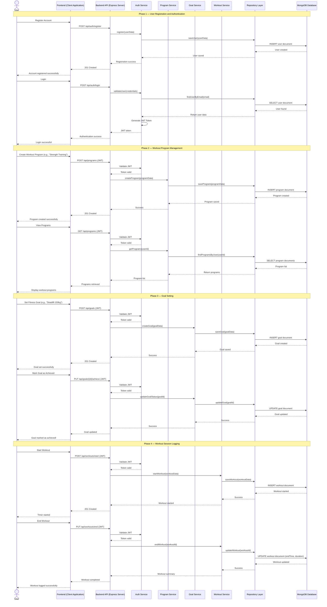

# Sequence Diagram — Fitness Tracker System

## Main Flow: User Authentication → Program Creation → Goal Creation → Workout Session

This sequence diagram illustrates the complete lifecycle of a user interacting with the Fitness Tracker System — from registering and logging in, to defining workout programs and fitness goals, and finally tracking a live workout session.

---

## Flow Summary

| Phase                     | Description                                                                     | Key Patterns Used           |
| ------------------------- | ------------------------------------------------------------------------------- | --------------------------- |
| **1. Authentication**     | User registers and logs in with JWT authentication and secure password storage. | Authentication Pattern, JWT |
| **2. Program Management** | User creates and views workout programs securely.                               | Layered Architecture        |
| **3. Goal Setting**       | User creates, updates, and completes fitness goals linked to programs.          | Service Layer Pattern       |
| **4. Workout Logging**    | User starts and ends workout sessions with duration tracking and persistence.   | Repository Pattern          |
| **5. Data Persistence**   | All health data is securely stored and retrieved from MongoDB.                  | Repository Pattern          |
