# Use Case Diagram — Fitness Tracker System

## Overview

This diagram shows all major use cases for the Fitness Tracker System, organized around the primary actor: **User**.
In addition to the core CRUD flows (programs, goals, sessions), the system now also serves a **Profile Dashboard** (BMI, streaks, goal achievement rate) and **Personalised Recommendations** (scored program templates). JWT validation and ownership enforcement remain system-driven use cases.

```mermaid
graph TB
    subgraph FitnessTrackerSystem[Fitness Tracker System]
        UC1["Register Account"]
        UC2["Login"]
        UC3["Logout"]

        UC4["Update Profile Details"]
        UC4a["Log Weight Entry"]
        UC4b["View Profile Dashboard (BMI, Streaks, Goal Rate)"]

        UC5["Create Workout Program"]
        UC5a["Adopt Program from Template"]
        UC6["View Programs"]
        UC7["Delete Program"]

        UC8["Create Fitness Goal"]
        UC9["View Goals"]
        UC10["Update Goal"]
        UC11["Delete Goal"]
        UC12["Mark Goal as Achieved"]

        UC13["Start Workout Session"]
        UC14["End Workout Session"]
        UC15["View Workout History"]

        UC16["View Progress Summary"]
        UC16a["View Recommended Programs"]

        UC17["Authenticate User (JWT Validation)"]
        UC18["Authorize User Access (Ownership)"]
        UC19["Save Data"]
        UC20["Retrieve Data"]
        UC21["Update Goal Status"]
        UC22["Calculate Workout Duration + Calories"]
        UC23["Compute Dashboard Stats (BMI, Streak)"]
        UC24["Score + Rank Program Templates"]
    end

    User((User))

    %% User use cases
    User --> UC1
    User --> UC2
    User --> UC3
    User --> UC4
    User --> UC4a
    User --> UC4b
    User --> UC5
    User --> UC5a
    User --> UC6
    User --> UC7
    User --> UC8
    User --> UC9
    User --> UC10
    User --> UC11
    User --> UC12
    User --> UC13
    User --> UC14
    User --> UC15
    User --> UC16
    User --> UC16a

    %% System-driven (include / extend)
    UC2 -.->|triggers| UC17
    UC17 -.->|enables| UC18
    UC5 -.->|triggers| UC19
    UC5a -.->|triggers| UC19
    UC8 -.->|triggers| UC19
    UC6 -.->|triggers| UC20
    UC9 -.->|triggers| UC20
    UC12 -.->|updates| UC21
    UC14 -.->|calculates| UC22
    UC4b -.->|computes| UC23
    UC16a -.->|uses| UC24
    UC4a -.->|appends| UC19
```

---

## Use Case Descriptions

| #    | Use Case                                | Actor  | Description                                                                           |
| ---- | --------------------------------------- | ------ | ------------------------------------------------------------------------------------- |
| UC1  | Register Account                        | User   | Create a new account using name, email, and password.                                 |
| UC2  | Login                                   | User   | Authenticate user and generate a JWT for secure access.                               |
| UC3  | Logout                                  | User   | End the client session by discarding the JWT.                                         |
| UC4  | Update Profile Details                  | User   | Edit name, age, gender, height, weight, fitness level, and bio (`PUT /api/profile`). |
| UC4a | Log Weight Entry                        | User   | Append a dated weight entry to the user's history (`POST /api/profile/weight`).      |
| UC4b | View Profile Dashboard                  | User   | View aggregated BMI, streaks, weekly workouts, and goal achievement rate (`GET /api/profile`). |
| UC5  | Create Workout Program                  | User   | Create a custom workout program.                                                      |
| UC5a | Adopt Program from Template             | User   | Materialise a curated template (e.g., *HIIT Fat Burner*) into a real program (`POST /api/programs/from-template`). |
| UC6  | View Programs                           | User   | View all workout programs created by the user.                                        |
| UC7  | Delete Program                          | User   | Remove a workout program from the system.                                             |
| UC8  | Create Fitness Goal                     | User   | Create a specific fitness goal under a program (e.g., "Run 5k").                      |
| UC9  | View Goals                              | User   | View all fitness goals created by the user.                                           |
| UC10 | Update Goal                             | User   | Modify goal details such as description or target value.                              |
| UC11 | Delete Goal                             | User   | Remove a fitness goal from the system.                                                |
| UC12 | Mark Goal as Achieved                   | User   | Update goal status from "Pending" to "Achieved".                                      |
| UC13 | Start Workout Session                   | User   | Start a timer for a specific workout program session.                                 |
| UC14 | End Workout Session                     | User   | Stop the timer, compute duration + calories, and save the session.                    |
| UC15 | View Workout History                    | User   | View a log of all past workout sessions.                                              |
| UC16 | View Progress Summary                   | User   | View overall progress on completed goals and total workout time.                      |
| UC16a | View Recommended Programs              | User   | View a ranked list of program templates with rationale and per-session calorie preview (`GET /api/profile/recommendations`). |
| UC17 | Authenticate User (JWT Validation)      | System | Verify JWT token on every protected request.                                          |
| UC18 | Authorize User Access (Ownership)       | System | Ensure a user can only access their own programs, goals, and sessions.                |
| UC19 | Save Data                               | System | Persist programs, goals, sessions, weight entries in the database (or in-memory fallback). |
| UC20 | Retrieve Data                           | System | Fetch user-specific data from the database.                                           |
| UC21 | Update Goal Status                      | System | Maintain and update the completion status of goals.                                   |
| UC22 | Calculate Workout Duration + Calories   | System | Compute `durationMinutes` and `caloriesBurned` via the `CalorieStrategy` picked by `CalorieStrategyFactory`. |
| UC23 | Compute Dashboard Stats                 | System | Derive BMI, streaks, and windowed aggregates in `ProfileService.getDashboard()`.      |
| UC24 | Score + Rank Program Templates          | System | `RecommendationService` applies a transparent weighted-sum model over fitness level, BMI, age, and primary goal. |
