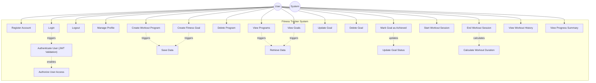

# Use Case Diagram — Fitness Tracker System

## Overview

This diagram shows all major use cases for the Fitness Tracker System, organized by the primary actor: User.
The system focuses on secure user authentication, workout program creation, goal setting, and session logging, while ensuring data privacy and structured backend operations using JWT authentication.

---

## Use Case Descriptions

| #    | Use Case                           | Actors | Description                                                      |
| ---- | ---------------------------------- | ------ | ---------------------------------------------------------------- |
| UC1  | Register Account                   | User   | Create a new account using name, email, and password.            |
| UC2  | Login                              | User   | Authenticate user and generate JWT token for secure access.      |
| UC3  | Logout                             | User   | Logout from the system and end the client session.               |
| UC4  | Manage Profile                     | User   | View and manage personal profile information.                    |
| UC5  | Create Workout Program             | User   | Create a workout program (e.g., "Weight LossPlan").              |
| UC6  | View Programs                      | User   | View all workout programs created by the user.                   |
| UC7  | Delete Program                     | User   | Remove a workout program from the system.                        |
| UC8  | Create Fitness Goal                | User   | Create a specific fitness goal under a program (e.g., "Run 5k"). |
| UC9  | View Goals                         | User   | View all fitness goals created by the user within a program.     |
| UC10 | Update Goal                        | User   | Modify goal details such as description or target value.         |
| UC11 | Delete Goal                        | User   | Remove a fitness goal from the system.                           |
| UC12 | Mark Goal as Achieved              | User   | Update goal status from "Pending" to "Achieved".                 |
| UC13 | Start Workout Session              | User   | Start a timer for a specific workout program session.            |
| UC14 | End Workout Session                | User   | Stop the timer and save the workout duration.                    |
| UC15 | View Workout History               | User   | View a log of all past workout sessions.                         |
| UC16 | View Progress Summary              | User   | View overall progress on completed goals and total workout time. |
| UC17 | Authenticate User (JWT Validation) | System | Verify JWT token to ensure secure authentication.                |
| UC18 | Authorize User Access              | System | Ensure user can only access their own programs and data.         |
| UC19 | Save Data                          | System | Store programs, goals, and sessions in the database.             |
| UC20 | Retrieve Data                      | System | Fetch user-specific data from the database.                      |
| UC21 | Update Goal Status                 | System | Maintain and update the completion status of goals.              |
| UC22 | Calculate Workout Duration         | System | Calculate session duration based on start and end time.          |
